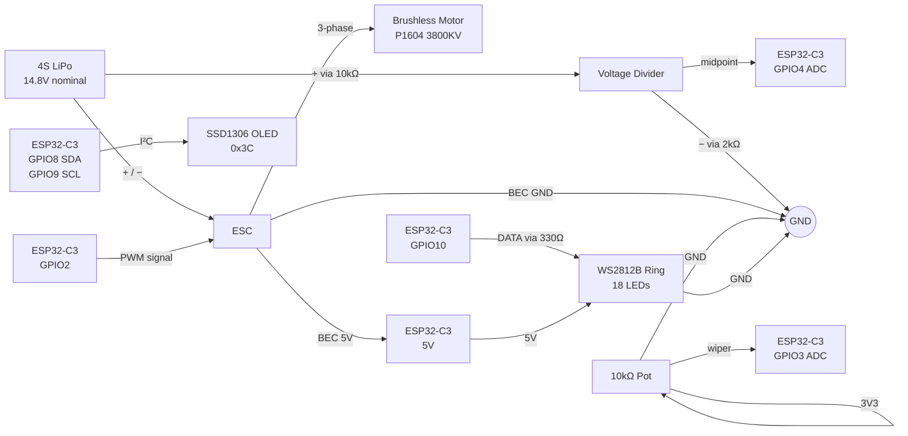
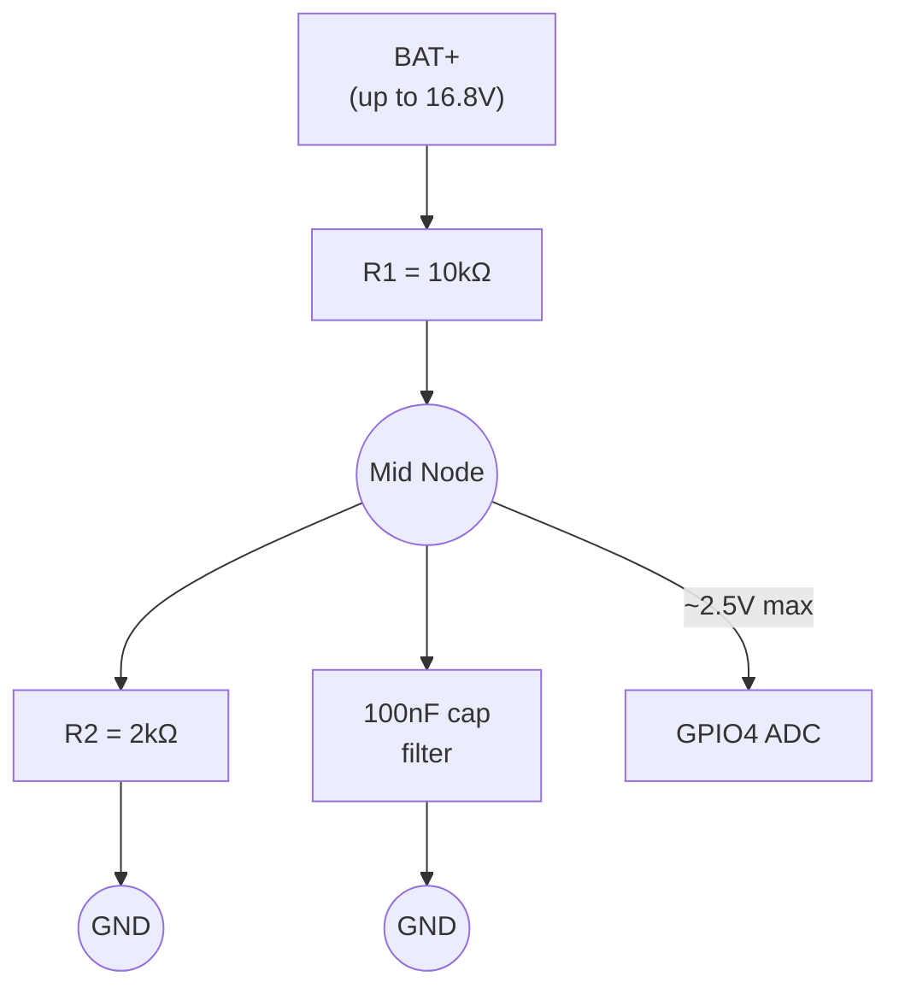
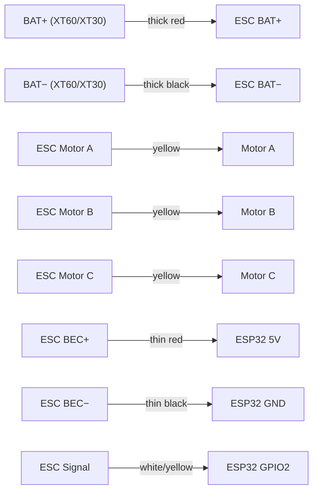
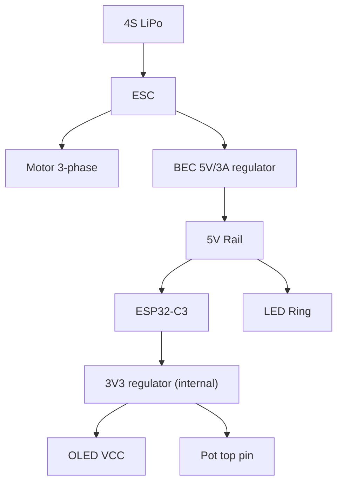

# Wiring Diagram

Complete schematic for the Turbine Brick controller.

## Block Diagram

## Voltage Divider Detail

**Calculation:** V_adc = V_bat × R2 / (R1 + R2) = V_bat × 0.1667
For full 4S at 16.8V → 2.80V at ADC ✓ (under 3.3V max)

## ESC Connections

If motor spins the wrong direction, swap any two of Motor A/B/C.

## Pin Reference Table

| ESP32-C3 GPIO | Function | Connects To | Notes |
|---|---|---|---|
| GPIO2 | ESC PWM signal | ESC signal wire | 1000-2000µs pulse |
| GPIO3 | POT wiper (ADC) | 10kΩ pot middle pin | 11dB attenuation required |
| GPIO4 | VBAT (ADC) | Divider midpoint | 11dB attenuation required, 100nF cap to GND |
| GPIO8 | I²C SDA | OLED SDA | Pull-ups on OLED module |
| GPIO9 | I²C SCL | OLED SCL | Pull-ups on OLED module |
| GPIO10 | LED data | WS2812B DIN (via 330Ω) | 5V tolerant signal |
| 5V | Power in | ESC BEC red wire | From ESC's 5V regulator |
| GND | Ground | Common ground bus | ALL grounds must connect |

## Critical Notes

**Common ground is mandatory.** ESC GND, ESP32 GND, OLED GND, LED strip GND, and voltage divider GND must all share the same ground point. The BEC provides this automatically when wired correctly.

**ADC attenuation must be set in software** before any analogRead. Without `analogSetPinAttenuation(PIN, ADC_11db)` the ESP32-C3 ADC saturates above ~750mV and readings are meaningless.

**Do not connect USB and battery simultaneously** unless your ESP32-C3 dev board has reverse-current protection on the USB Vbus rail. When in doubt, disconnect one before connecting the other.

**100nF filter capacitor on GPIO4** is recommended close to the ESP32 pin. It significantly reduces voltage reading noise.

**330Ω series resistor on LED data line** is recommended. Protects the first LED from voltage spikes and reduces signal reflections.

## Power Architecture

The ESC's BEC handles voltage regulation from 14.8V battery down to 5V for the ESP32. The ESP32's internal regulator further drops to 3.3V for the OLED and pot reference. No separate regulators needed.
