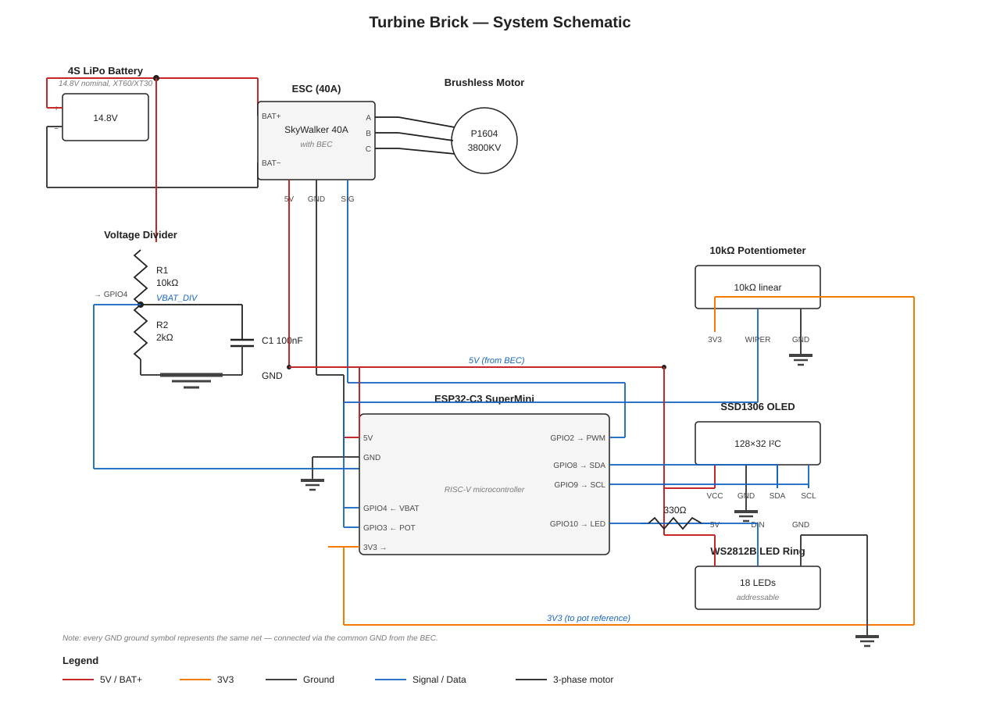
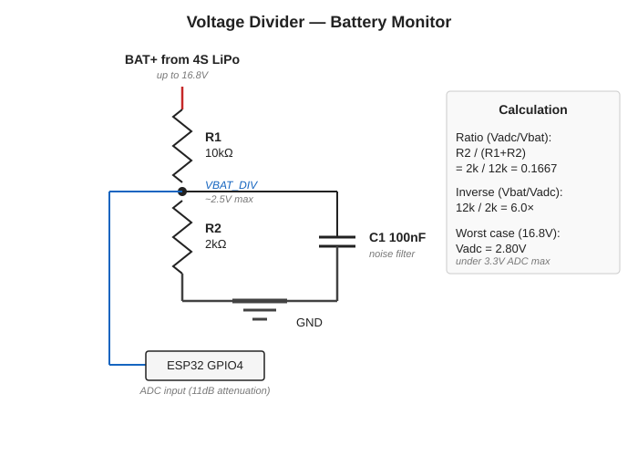
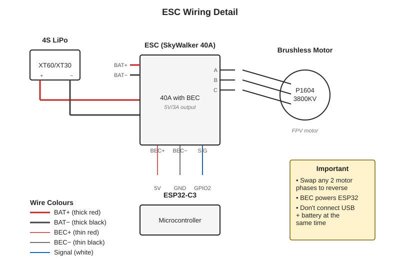
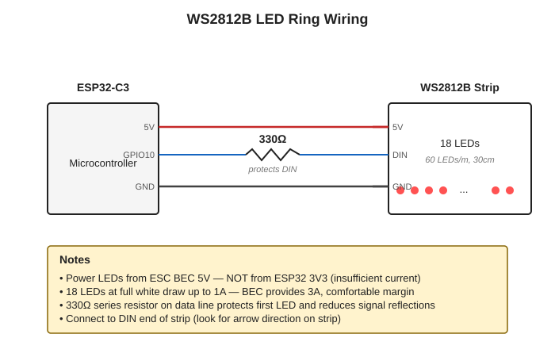

# Wiring Diagram

Complete schematic for the Turbine Brick controller.

## System Overview

The full schematic showing all components and their connections:



The system has four power/signal domains:

- **Battery rail** (red, ~14.8V) — feeds ESC, divided down for ADC monitoring
- **5V BEC rail** (red, thin) — powers ESP32 and LED strip
- **Ground** (black) — shared across all components
- **Signal lines** (blue) — PWM, I²C, ADC inputs, LED data

## Voltage Divider Detail

Battery voltage monitoring uses a resistor divider to scale 4S LiPo voltage (up to 16.8V) down to the ESP32 ADC range (3.3V max):



The 100nF capacitor between the divider midpoint and GND filters high-frequency noise that otherwise causes ADC reading jitter. Place it physically close to the ESP32 GPIO4 pin for best effect.

**Critical: R2 must be on the GND side.** Reversed resistors give the wrong ratio and could push >3.3V into the ADC, damaging the chip.

The ESP32-C3 ADC requires `analogSetPinAttenuation(PIN_VBAT, ADC_11db)` in setup() — without 11dB attenuation the ADC saturates above ~750mV and readings are meaningless.

## ESC Wiring Detail

The ESC handles power delivery, motor control, and provides a regulated 5V output (BEC) to power the ESP32:



**Motor wire order doesn't matter** — connect ESC A/B/C to motor A/B/C in any order. If the motor spins the wrong direction, swap any two of the three phase wires.

**The BEC provides 5V to the ESP32**, eliminating the need for a separate power supply. This is why USB and battery should not be connected simultaneously (unless the dev board has reverse-current protection).

## LED Ring Wiring Detail

The WS2812B LED ring needs its own 5V rail from the BEC (the ESP32's regulator can't supply enough current):



The 330Ω series resistor on the data line is a recommended best practice. It protects the first LED from voltage spikes and reduces signal reflections on the data line.

## Pin Reference Table

| ESP32-C3 GPIO | Function | Connects To | Notes |
|---------------|----------|-------------|-------|
| GPIO2 | ESC PWM signal | ESC signal wire | 1000-2000µs pulse width |
| GPIO3 | POT wiper (ADC) | 10kΩ pot middle pin | 11dB attenuation required |
| GPIO4 | VBAT (ADC) | Divider midpoint | 11dB attenuation, 100nF cap to GND |
| GPIO8 | I²C SDA | OLED SDA | Pull-ups on OLED module |
| GPIO9 | I²C SCL | OLED SCL | Pull-ups on OLED module |
| GPIO10 | LED data | WS2812B DIN (via 330Ω) | 5V tolerant signal |
| 5V | Power in | ESC BEC red wire | From ESC's regulator |
| GND | Ground | Common ground bus | All grounds must connect |

## Critical Notes

**Common ground is mandatory.** ESC GND, ESP32 GND, OLED GND, LED strip GND, and voltage divider GND must all share the same ground point. The BEC provides this automatically when wired correctly.

**ADC attenuation must be set in software** before any analogRead. Without `analogSetPinAttenuation(PIN, ADC_11db)` the ESP32-C3 ADC saturates above ~750mV.

**Do not connect USB and battery simultaneously** unless your ESP32-C3 dev board has reverse-current protection on the USB Vbus rail. When in doubt, disconnect one before connecting the other.

**100nF filter capacitor on GPIO4** is recommended close to the ESP32 pin. Significantly reduces voltage reading noise.

**330Ω series resistor on LED data line** is recommended. Protects the first LED from voltage spikes.

## Power Architecture

Power flows from the battery through the ESC's BEC, which provides regulated 5V to the ESP32 and LED ring. The ESP32's internal 3.3V regulator further supplies the OLED and pot reference.

```
4S LiPo (~14.8V)
   │
   ├──► ESC ──► Motor (3-phase, brushless)
   │     │
   │     └──► BEC (5V, 3A) ──► ESP32 5V ──► (internal 3V3 reg) ──► OLED + Pot
   │                       │
   │                       └──► LED ring 5V
   │
   └──► Voltage divider ──► ESP32 GPIO4 (ADC, monitoring)
```

No separate regulators or external power supplies needed. The ESC's BEC handles everything.
